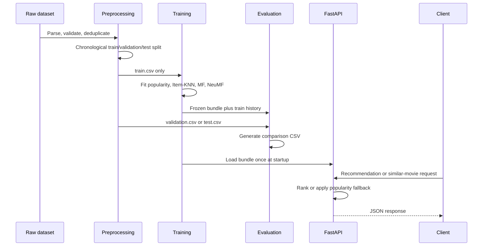

# Architecture notes

## Design intent

Offline work and online inference are deliberately separated. This makes data leakage easier to prevent and keeps serving latency independent of training code.

## Offline components

| Component | Responsibility | Leakage boundary |
| --- | --- | --- |
| `data.preprocessing` | Parse, validate, deduplicate, and time-split source data | Splits are written before training |
| `features.aggregates` | Produce train-derived statistics | Caller passes training data explicitly |
| `models.*` | Fit models behind a consistent prediction/recommendation interface | Workflow passes only `train.csv` to `fit` |
| `evaluation.metrics` | Calculate rating and ranking metrics | Models are not fitted here |
| `evaluation.reporting` | Build and save comparison tables | Holdout labels are used only for metrics |
| `pipeline` | Orchestrate reproducible CLI jobs and artifacts | `train()` does not read validation/test files |

## Online components

| Component | Responsibility |
| --- | --- |
| `pipeline.recommendation_service` | Loads the saved bundle; does not fit models |
| `inference.RecommendationService` | Resolves external IDs, filters seen movies, selects NeuMF or fallback |
| `api.create_app` | Initializes FastAPI and loads the bundle once in its lifespan hook |
| `Dockerfile` / `docker-compose.yml` | Run inference with externally mounted configuration and model artifacts |

## Artifact contract

`models/recommender_bundle.joblib` contains the model dictionary, training interactions for seen-item filtering, and the training seed. It is a local runtime artifact. A production deployment should use a model registry or artifact store rather than Git.

## Scaling boundary

The implementation favors clarity and testability. At production catalog/user scale, replace dense Item-KNN with sparse or ANN retrieval, persist compact ID mappings, batch NeuMF scoring, and separate candidate generation from ranking.
